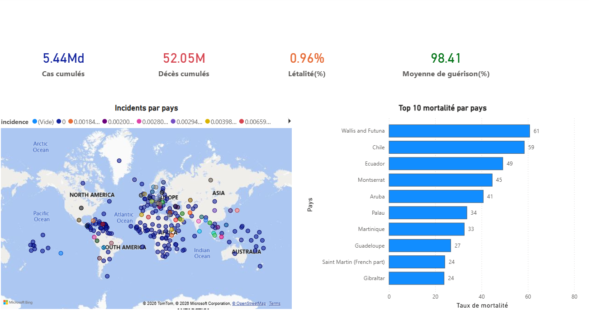
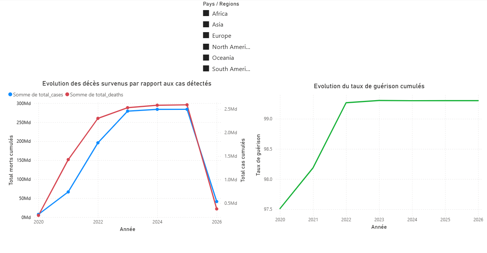
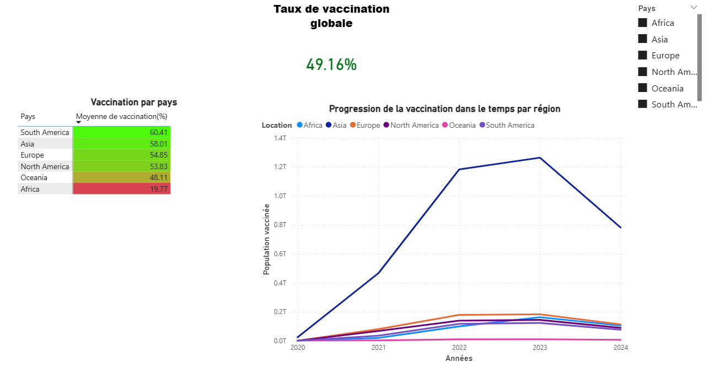

# **COVID-19 Epidemiological Study**

---
### Context
---

I wanted to analyze the evolution of the COVID-19 pandemic in order to evaluate the effectiveness of public health measures that could allow anticipating future needs.

### Methodology

- **Data sources**: Our World in Data (OWID), public health databases.
- **Data cleaning**: removal of anomalies, handling of missing values.
- **Python scripts**: KPI calculations, time series modeling.
- **Power BI Dashboard**: interactive visualization of results.

#
### Introduction 
 
Specifications

##### \- Describe the dynamics of virus spread.

##### \- Identify temporal and geographical trends.

##### \- Calculate epidemiological indicators (incidence, mortality, lethality, recovery).

##### \- Produce interactive visualizations (Power BI).

##### \- Provide a documented report of the results.

# 

### Organization of the repositories

##### \- `data/` : raw data sets: reliable public data sources (WHO, Our World in Data).

##### \- `notebooks/` : Exploratory analyses with Python.

##### \- `power bi/` : Interactive Power BI dashboard.

##### \- `docs/` : Results report.

# 

### Available data
Large files (e.g., `owid-covid-data.csv`) are not included in this repository.
They can be downloaded directly from [Our World in Data](https://ourworldindata.org/covid-data).

# 
### Dashboard screenshots

